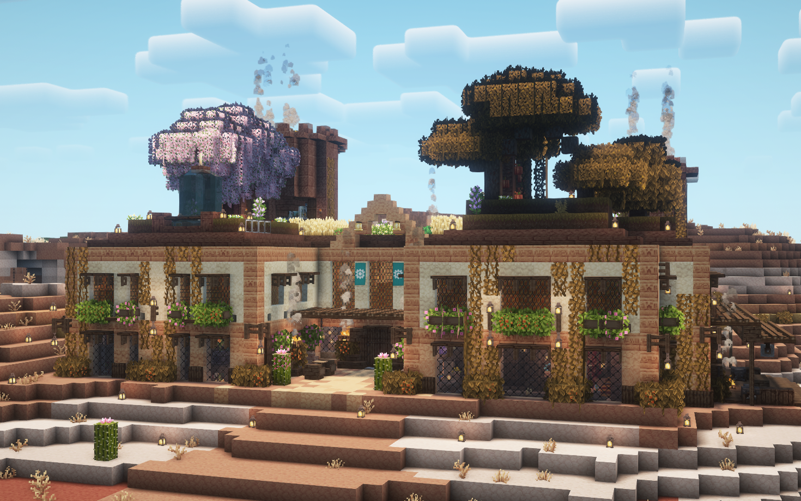

# FugCraft Server

<div align="center">
  

  <h3>🎮 Plug and Play Minecraft Server (Vanilla+)</h3>

  [](client-resources/README.md)
</div>

---

## 🎯 For Players

**Joining the server?** Check out the **[Client Resources](client-resources/README.md)** for everything you need to get started!

- 📦 **Custom modpack**
- 🎨 **Curated resource packs**
- ✨ **Optimized shader recommendations**
- ⚙️ **Easy setup guide**

---

## 🚀 For Server Hosts

Want to run your own FugCraft server? This repository contains everything you need!

### 📥 **Quick Setup**

**Prerequisites:** You need **Java 21** (recommended) or Java 17+ installed:
- **[Download Java 21](https://www.oracle.com/java/technologies/downloads/#java21)** (recommended)
- Java 17+ will also work if you already have it installed

1. **Clone this repository:**
   ```bash
   git clone https://github.com/FugLong/FugCraft-Server.git
   cd FugCraft-Server
   ```

2. **Start the server:**
   - **Windows:** Run `start-server.bat`
   - **Linux/Mac:** Run `./start-server.sh`

3. **Configure your server:**
   - Edit `server.properties` for basic settings
   - Modify config files in `config/` as needed
   - Set up LuckPerms permissions (see guide below)

### ⚙️ **RAM Configuration**

**Important:** You may need to adjust RAM allocation based on your system!

The startup scripts use these default values:
- **Minimum RAM:** `4G` (4 GB)
- **Maximum RAM:** `12G` (12 GB)

#### 🔧 **How to Change RAM:**

**In `start-server.bat` (Windows):**
```batch
-Xms4G -Xmx12G
```

**In `start-server.sh` (Linux/Mac):**
```bash
-Xms4G -Xmx12G
```

#### 📊 **Recommended RAM Settings:**

| System RAM | Min (-Xms) | Max (-Xmx) | Notes |
|------------|------------|------------|-------|
| 8 GB       | 2G         | 6G         | Minimum viable |
| 16 GB      | 4G         | 8G         | Good performance |
| 32 GB      | 6G         | 16G        | High performance |
| 64 GB+     | 8G         | 24G        | Maximum performance |

#### 💡 **Examples:**

**For a 16GB system:**
```bash
-Xms4G -Xmx8G
```

**For a 32GB system:**
```bash
-Xms6G -Xmx16G
```

**For a 8GB system:**
```bash
-Xms2G -Xmx6G
```

### 📁 **What's Included**

- ✅ **Server JAR** - Fabric server launcher
- ✅ **Mods** - All required server mods
- ✅ **Configs** - Pre-configured mod settings
- ✅ **Startup Scripts** - Cross-platform launchers
- ✅ **LuckPerms** - Permission system (groups/tracks only)

### 📋 **Server Mod List**

> **💡 Tip:** You can disable any mod by renaming its `.jar` file to `.jar.disabled` in the `/mods` folder (e.g., `remorphed.jar` → `remorphed.jar.disabled`)

The server includes these mods (Fabric 1.21.8):

**Core & Performance:**
- Fabric API - Core Fabric functionality
- Lithium - Server-side performance optimizations
- C2ME - Chunk loading optimizations
- Noisium - Performance improvements
- Alternate Current - Redstone optimizations
- ScalableLux - Lighting optimization

**Server Management:**
- LuckPerms - Permission system
- Essential Commands - Essential server commands
- Auto Restart - Automatic server restarts
- Advanced Backups - Server backup system

**Gameplay Features:**
- Open Parties and Claims - Land claiming system
- Inventory Sorter - Automatic inventory sorting
- Falling Tree - Tree chopping mechanics
- KleeSlabs - Slab breaking mechanics
- Graves - Death chest system
- Pet Protect - Pet protection
- Pet Teleport Fix - Pet teleportation fixes
- Anvil Restoration - Anvil repair mechanics (right-click anvil with iron to repair)
- ReMorphed - Transform into mobs/players after killing them

**Visual & Client Features:**
- Distant Horizons - Extended render distance
- Jade - Block/entity information display
- Styled Chat - Enhanced chat system
- Styled Player List - Enhanced player list

**Cross-Platform:**
- Geyser - Bedrock edition support
- Floodgate - Bedrock authentication
- Fabric Permissions API - Permission system API
- Vanilla Permissions - Vanilla permission support

**Utilities:**
- Mod Menu - In-game mod configuration
- Cloth Config - Configuration framework
- Forge Config API Port - Configuration compatibility
- Collective - Library mod
- CraftedCore - Core functionality
- Balm - Library mod
- Lithostitched - Lithium compatibility
- InvView - Inventory viewing
- VMP - Voice mod support
- WorldEdit - World editing tools
- CTov - Structure generation
- Walkers - Mob transformation library (dependency)
- SkinShifter - Skin changing library (dependency)

### 👥 **LuckPerms Permission Setup**

The server comes with pre-configured permission groups and tracks. Here's how to give yourself admin access:

#### **Quick Setup - Give Yourself Owner Permissions:**

**Option 1: Using Console Command**
1. Join your server
2. Open the server console
3. Run: `lp user <your-username> permission set luckperms.* true`
4. Now you can use all LuckPerms commands in-game

**Option 2: Using LuckPerms Editor (Easier)**
1. In server console, run: `lp editor`
2. Click the link that appears in console
3. In the web editor, go to **Users** → find your username
4. Give yourself the `owner` group
5. Save and close

#### **Available Groups:**
These groups build on one another - each level includes all permissions from lower groups plus additional ones.

- **`default`** - New players (basic permissions)
  - Can set 1 home, basic commands only

- **`member`** - Regular players  
  - Can set 3 homes, access to warps + more commands, can use ReMorphed mod (no flying mobs)

- **`citizen`** - Trusted players
  - Can set 5 homes, can nickname themselves, basic flying and lava walking mobs in ReMorphed

- **`moderator`** - Staff members
  - Can set 10 homes, can kick players, can TP without requesting, more mod commands, special ReMorphed forms like ender dragon

- **`veteran`** - Long-time players
  - Like moderators but can set 20 homes, access to cheaty commands like `/anvil`, `/enderchest`, `/feed`

- **`admin`** - Administrators
  - Can set 25 homes, `/ban`, `/ban-ip`, `/fly`, `/heal`, `/repair`, `/invuln`, can set/delete warps and spawn

- **`coowner`** - Co-owners
  - Admins with infinite homes

- **`owner`** - Server owner
  - Access to all commands

> **Note:** This is a general overview. Check the LuckPerms editor to see and edit all specific permissions for each group.

#### **Need More Help?**
- **[LuckPerms Documentation](https://luckperms.net/wiki/Home)** - Complete guide
- Permission files are in: `mods/luckperms/yaml-storage/`

### 🔒 **Security Notes**

This repository excludes sensitive data:
- Player data and inventories
- Server logs and IPs
- Player permissions assignments
- World data (backup elsewhere)

---

<div align="center">
  <p><strong>Enjoy your FugCraft experience! 🎮</strong></p>
</div>
</div>