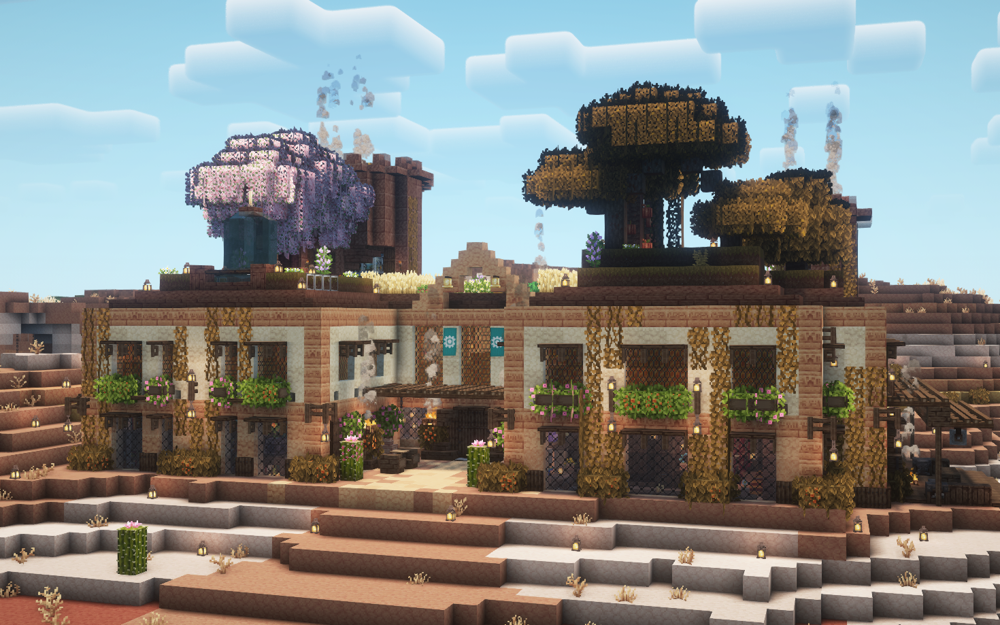

# FugCraft Server

<div align="center">
  

  <h3>🎮 Plug and Play Minecraft Server (Vanilla++)</h3>

  [](client-resources/README.md)
</div>

---

## 🎯 For Players

**Joining the server?** Check out the **[Client Resources](client-resources/README.md)** for everything you need to get started!

FugCraft is **Vanilla++ multiplayer** — still Minecraft at heart, just faster, farther, and richer:

- 🌍 **See forever** — Sodium + Voxy for smooth performance and massive render distance
- 🗺️ **Explore more** — Biomes O' Plenty, overhauled structures, Moogs structure packs, synced seasons
- 🤝 **Built for friends** — voice chat, parties, claims, shops, and graves
- 🍳 **Cook & farm** — Farmer's Delight with addon content
- 📦 **One-click modpack** on Modrinth with curated resource packs pre-configured

---

## 🚀 For Server Hosts

Want to run your own FugCraft server? This repository contains everything you need!

### 📥 **Quick Setup**

**Prerequisites:** You need **Java 21** (recommended) or Java 17+ installed:
- **[Download Java 21](https://www.oracle.com/java/technologies/downloads/#java21)** (recommended)
- Java 17+ will also work if you already have it installed

1. **Clone this repository:**
   ```bash
   git clone https://github.com/FugLong/FugCraft-Server.git
   cd FugCraft-Server
   ```

2. **Start the server:**
   - **Windows:** Run `start-server.bat`
   - **Linux/Mac:** Run `./start-server.sh`

3. **Configure your server:**
   - Edit `server.properties` for basic settings
   - Modify config files in `config/` as needed
   - **Highly recommended to delete HoloDisplays config**
   - Set up LuckPerms permissions (see guide below)

### ⚙️ **RAM Configuration**

**Important:** You may need to adjust RAM allocation based on your system!

The startup scripts use these default values:
- **Minimum RAM:** `4G` (4 GB)
- **Maximum RAM:** `12G` (12 GB)

#### 🔧 **How to Change RAM:**

**In `start-server.bat` (Windows):**
```batch
-Xms4G -Xmx12G
```

**In `start-server.sh` (Linux/Mac):**
```bash
-Xms4G -Xmx12G
```

#### 📊 **Recommended RAM Settings:**

| System RAM | Min (-Xms) | Max (-Xmx) | Notes |
|------------|------------|------------|-------|
| 8 GB       | 2G         | 6G         | Minimum viable |
| 16 GB      | 4G         | 8G         | Good performance |
| 32 GB      | 6G         | 16G        | High performance |
| 64 GB+     | 8G         | 24G        | Maximum performance |

#### 💡 **Example:**

**For a 8GB system:**
```bash
-Xms2G -Xmx6G
```

### 📁 **What's Included**

- ✅ **Server JAR** - Fabric server launcher
- ✅ **Mods** - All required server mods
- ✅ **Configs** - Pre-configured mod settings
- ✅ **Startup Scripts** - Cross-platform launchers
- ✅ **LuckPerms** - Permission system (groups/tracks only)

### 📋 **Server Mod List**

> **💡 Tip:** You can disable many mods by renaming their `.jar` file to `.jar.disabled` in `/mods` (for example: `mod.jar` → `mod.jar.disabled`).

The server currently targets **Minecraft 26.1.2 (Fabric)**.

The list below is an exact snapshot of enabled top-level `mods` jars in this repo (`.jar.disabled` / `.jar.DISABLED` files are omitted):

- `alternate-current-mc26.1-1.9.0.jar`
- `anvilrestoration-26.1.2-2.5.jar`
- `architectury-19.0.1-fabric.jar`
- `baguettelib-26.1.2-Fabric-2.0.4.jar`
- `balm-fabric-26.1.2-26.1.2.6.jar`
- `betterdays-26.1.2-fabric-4.1.1.6-FABRIC.jar`
- `BiomesOPlenty-fabric-26.1.2-26.1.2.0.11.jar`
- `bubblecolumntweaks-1.1.0.jar`
- `c2me-fabric-mc26.1.2-0.4.0-alpha.0.28.jar`
- `camerapture-1.10.14+mc26.1.2.jar`
- `cloth-config-26.1.154.jar`
- `collective-26.1.2-8.22.jar`
- `commandaliases-1.0.4+mc26.1.2-unknown.jar`
- `controlify-3.0.1+26.1-fabric.jar`
- `CopperGratesBubbleThru-2.1+26.1.2.jar`
- `craftedcore-fabric-8.0.jar`
- `crashexploitfixer-fabric-2.0.0+26.1.2.jar`
- `cratedelight-26.03.26+26.1-fabric.jar`
- `cristellib-fabric-26.1.2-3.1.4.jar`
- `delightlib-26.05.18-26.1-fabric.jar`
- `DiagonalFences-v26.1.0-mc26.1.x-Fabric.jar`
- `DiagonalWalls-v26.1.0-mc26.1.x-Fabric.jar`
- `DiagonalWindows-v26.1.0-mc26.1.x-Fabric.jar`
- `display-delight-1.8.1-mc26.1.2.jar`
- `dungeons-and-taverns-5.2.0.jar`
- `dungeons-and-taverns-ancient-city-overhaul-3.3.jar`
- `dungeons-and-taverns-desert-temple-overhaul-v2.1.jar`
- `dungeons-and-taverns-jungle-temple-overhaul-v2.1.jar`
- `dungeons-and-taverns-nether-fortress-overhaul-v3.1.jar`
- `dungeons-and-taverns-ocean-monument-overhaul-v2.2.jar`
- `dungeons-and-taverns-pillager-outpost-overhaul-v3.3.jar`
- `dungeons-and-taverns-stronghold-overhaul-v2.4.0.jar`
- `dungeons-and-taverns-swamp-hut-overhaul-v2.3.jar`
- `dungeons-and-taverns-woodland-mansion-overhaul-2.1.jar`
- `EasyMagic-v26.1.0-mc26.1.x-Fabric.jar`
- `effortlessbuilding-fabric-26.1.2-4.1.jar`
- `essential_commands-0.39.0-mc26.1.1.jar`
- `fabric-api-0.149.1+26.1.2.jar`
- `fabric-language-kotlin-1.13.11+kotlin.2.3.21.jar`
- `FallingTree-26.1.2-25.jar`
- `FarmersDelight-26.1-3.6.5+refabricated.jar`
- `FastItemFrames-v26.1.0-mc26.1.x-Fabric.jar`
- `ferritecore-9.0.0-fabric.jar`
- `ForgeConfigAPIPort-v26.1.4-mc26.1.x-Fabric.jar`
- `friendsandfoes-fabric-4.0.26+mc26.1.2.jar`
- `GlitchCore-fabric-26.1.2-26.1.2.0.2.jar`
- `glow_up-fabric-26.1.2-2.1.0-26.1-26.1.2.jar`
- `graves-3.11.1+26.1.2.jar`
- `holodisplays-0.5.0+26.1-26.1.2.jar`
- `HopperGadgetry-v26.1.0-mc26.1.x-Fabric.jar`
- `htm-1.2.3.jar`
- `immersive_optimization-fabric-26.1.2-0.1.5.jar`
- `inventorysorter-fabric-3.0.0-beta.4+mc26.1.2.jar`
- `InvView-1.4.20-26.1+.jar`
- `Jade-mc26.1-Fabric-26.1.0.jar`
- `journeymap-fabric-26.1.2-6.0.0-beta.81.jar`
- `JourneyPAC-fabric-26.1.2-1.1.10.jar`
- `kleeslabs-fabric-26.1-26.1.0.1.jar`
- `krypton-0.3.0.jar`
- `leash-villager-1.0.0+mc26.1.jar`
- `lithium-fabric-0.24.2+mc26.1.2.jar`
- `lithostitched-1.7.7-fabric-26.1.jar`
- `LuckPerms-Fabric-5.5.52.jar`
- `ly-combat-log-v1.0.3.jar`
- `mcw-paths-1.1.1-mc26.1fabric.jar`
- `modmenu-18.0.0-beta.1.jar`
- `moogs_structure_lib-2.0.1-26.1.0-26.1.2.jar`
- `MoogsBountifulStructures-1.21-1.0.6.jar`
- `MoogsEndStructures-1.21-2.0.3.jar`
- `MoogsNetherStructures-1.21-2.1.0.jar`
- `MoogsSoaringStructures-1.21-2.1.2.jar`
- `MoogsVoyagerStructures-1.21-5.0.11.jar`
- `moredelight-26.05.26-26.1-fabric.jar`
- `mru-1.0.28+lts+26.1-fabric.jar`
- `NoChatReports-FABRIC-26.1-v2.19.0.jar`
- `oldschooljail-1.1.0.jar`
- `open-parties-and-claims-fabric-26.1.2-0.26.3.jar`
- `otterlib-0.3.0.1+26.1-fabric.jar`
- `packetfixer-fabric-3.3.5-26.1.2.jar`
- `pet-teleport-fix-1.4-HOTFIX.jar`
- `petprotect-1.1.4.jar`
- `placeholder-api-3.0.0+26.1.jar`
- `polymer-bundled-0.16.5+26.1.2.jar`
- `PuppetPlayers-1.6.1+26.1.2.jar`
- `PuzzlesLib-v26.1.8-mc26.1.x-Fabric.jar`
- `real-serene-seasons-1.0.4.jar`
- `ResourcefulLib-4.0.1.jar`
- `RoughlyEnoughItems-fabric-26.1.9999.jar`
- `rusticdelight-fabric-26.1-1.6.0.jar`
- `ScalableLux-0.2.0+fabric.2b63825-all.jar`
- `seasoncache-1.4.0.jar`
- `SereneSeasons-fabric-26.1.2-26.1.2.0.2.jar`
- `ServerLinksSender-1.1.0.jar`
- `silkiertouch-26.1.2-1.2.jar`
- `sit!-1.2.6.2+26.1.jar`
- `SnowUnderTrees-2.7.6+26.1.jar`
- `sodium-fabric-0.8.12+mc26.1.2.jar`
- `sound-physics-remastered-fabric-1.5.1+26.1.2.jar`
- `spark-1.10.172-fabric.jar`
- `starterkit-26.1.2-8.0.jar`
- `styled-chat-2.12.0+26.1.2.jar`
- `styledplayerlist-3.11.1+26.1.jar`
- `t_and_t-fabric-neoforge-1.13.11.jar`
- `TaxFreeLevels-1.5.2-fabric-26.1.jar`
- `TerraBlender-fabric-26.1.2-26.1.2.0.2.jar`
- `travelersbackpack-fabric-26.1.2-11.2.6.jar`
- `undergroundworlds-fabric-3.1.1-26.1.jar`
- `universal_shops-1.14.0+26.1.jar`
- `UniversalBoneMeal-v26.1.0-mc26.1.x-Fabric.jar`
- `vanilla-permissions-0.3.6+26.1.2.jar`
- `vanish-1.6.8+26.1.jar`
- `vcinteraction-fabric-1.0.8+26.1.2.jar`
- `veinminer-enchant-2.10.1.jar`
- `veinminer-fabric-2.10.1.jar`
- `villagerconverting-1.5.2+26.1.jar`
- `villagernames-26.1.2-8.4.jar`
- `VisualWorkbench-v26.1.0-mc26.1.x-Fabric.jar`
- `vmp-fabric-mc26.1.2-0.2.0+beta.7.234-all.jar`
- `voicechat-fabric-2.6.17+26.1.2.jar`
- `Voxy World Gen V2-26.1.2-2.2.4.jar`
- `voxy-0.2.16-beta.jar`
- `voxy-server-side-fabric.jar`
- `worldedit-mod-7.4.3.jar`
- `yet_another_config_lib_v3-3.9.3+26.1-fabric.jar`

> Current total: **124 jars** (enabled only).

### 👥 **LuckPerms Permission Setup**

The server comes with pre-configured permission groups and tracks. Here's how to give yourself admin access:

#### **Quick Setup - Give Yourself Owner Permissions:**

**Option 1: Using Console Command**
1. Join your server
2. Open the server console
3. Run: `lp user <your-username> permission set luckperms.* true`
4. Now you can use all LuckPerms commands in-game

**Option 2: Using LuckPerms Editor (Easier)**
1. In server console, run: `lp editor`
2. Click the link that appears in console
3. In the web editor, go to **Users** → find your username
4. Give yourself the `owner` group
5. Save and close

#### **Available Groups:**
These groups build on one another - each level includes all permissions from lower groups plus additional ones.

- **`default (guest)`** - New players (basic permissions)
  - Can set 1 home, basic commands only, claim 32 chunks max

- **`member`** - Regular players  
  - Can set 3 homes, access to warps + more commands, claim 64 chunks max

- **`citizen`** - Trusted players
  - Can set 5 homes, can nickname themselves, claim 128 chunks max

- **`moderator`** - Staff members
  - Can set 10 homes, can kick players, can TP without requesting, more mod commands, claim 256 chunks max

- **`veteran`** - Long-time players
  - Like moderators but can set 20 homes, access to cheaty commands like `/anvil`, `/enderchest`, `/feed`

- **`admin`** - Administrators
  - Can set 25 homes, `/ban`, `/ban-ip`, `/fly`, `/heal`, `/repair`, `/invuln`, `/vanish', can set/delete warps and spawn, claim 512 chunks max

- **`coowner`** - Co-owners
  - Admins with infinite homes, can see vanished players

- **`owner`** - Server owner
  - Access to all commands, can claim 1024 chunks max

> **Note:** This is a general overview. Check the LuckPerms editor to see and edit all specific permissions for each group.

#### **Need More Help?**
- **[LuckPerms Documentation](https://luckperms.net/wiki/Home)** - Complete guide
- Permission files are in: `mods/luckperms/yaml-storage/`

### 🔒 **Security Notes**

This repository excludes sensitive data:
- Player data and inventories
- Server logs and IPs
- Player permissions assignments
- World data (backup elsewhere)

---

<div align="center">
  <p><strong>Enjoy your FugCraft experience! 🎮</strong></p>
</div>
</div>
